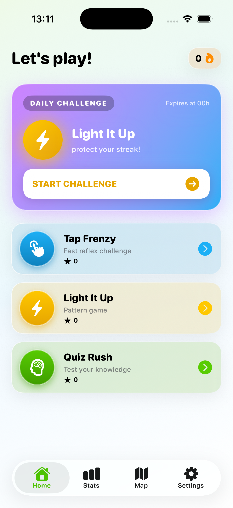
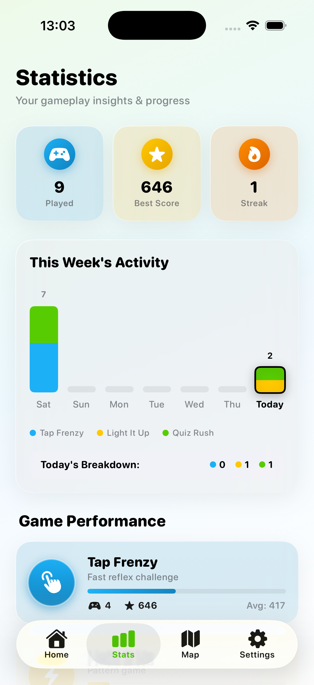
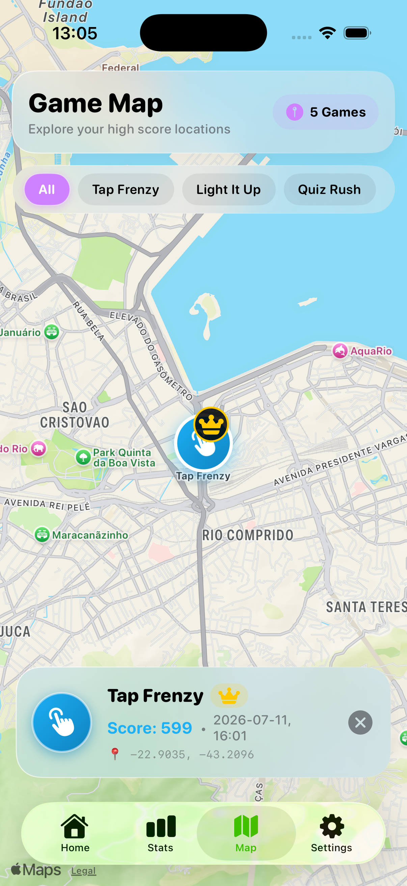
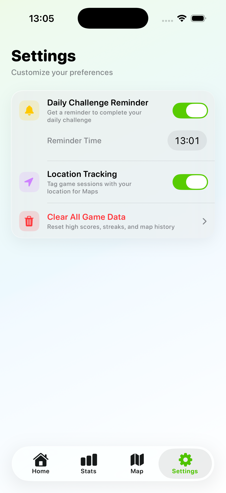
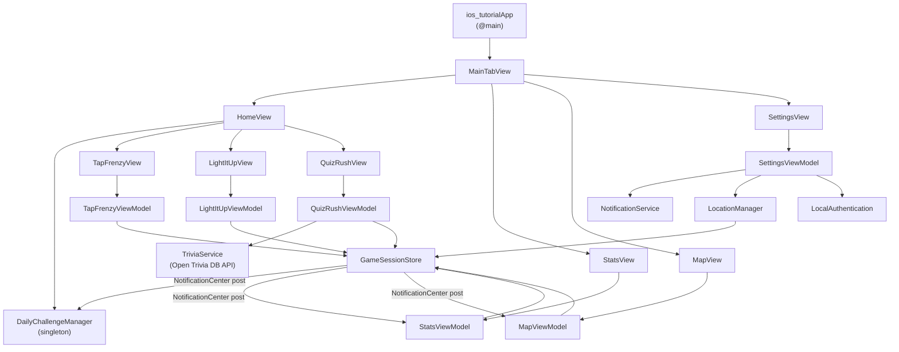

# Arcade | Mini Game Collection

> a Multi game interactive iOS application built with SwiftUI

---

## Table of Contents

- [Screenshots](#screenshots)
- [Tech Stack](#tech-stack)
- [Architecture](#architecture)
- [Folder Structure](#folder-structure)
- [Features by Game](#features-by-game)
- [App-Wide Features](#app-wide-features)
- [Setup & Running](#setup--running)
- [Known Limitations](#known-limitations)
- [Reflection](#reflection)

---

## Screenshots

<table>
  <tr>
    <td align="center"><b>Home</b></td>
    <td align="center"><b>Stats</b></td>
  </tr>
  <tr>
    <td></td>
    <td></td>
  </tr>
  <tr>
    <td align="center"><b>Map</b></td>
    <td align="center"><b>Settings</b></td>
  </tr>
  <tr>
    <td></td>
    <td></td>
  </tr>
</table>

---

## Tech Stack

| Technology | Usage |
|---|---|
| **SwiftUI** | All views and navigation |
| **Swift Concurrency (`async/await`)** | Network calls in `QuizRushService` |
| **Combine** | Reactive data flow between ViewModels and services |
| **CoreLocation** | GPS coordinates tagged to each game session |
| **MapKit** | Interactive map of geo-tagged game sessions |
| **UserNotifications** | Scheduled daily challenge reminders |
| **LocalAuthentication** | Face ID / Touch ID gate before clearing all game data |
| **SwiftUI Charts** | 7-day activity bar chart in Stats view |
| **UserDefaults** | Persistence of high scores, settings, and daily challenge state |
| **Open Trivia DB API** | Live question bank for Quiz Rush (`opentdb.com`) |
| **UIActivityViewController** | Native share sheet for posting scores |

---

## Architecture

The app follows a strict **MVVM (Model-View-ViewModel)** pattern with cross-cutting services extracted into dedicated singleton classes.



### Key Design Decisions

- **Singleton services** (`LocationManager`, `NotificationService`, `DailyChallengeManager`) are shared singletons so that permission state and streak data are consistent app-wide.
- **`NotificationCenter`** is used to broadcast `.gameSessionSaved` events — decoupling game ViewModels from Stats, Map, and Daily Challenge consumers without tight references.
- **`@AppStorage`** is used for lightweight key-value preferences (settings toggles, high scores); `GameSessionStore` handles the heavier JSON-encoded session history.
- **`@MainActor`** is applied to all ViewModels to guarantee UI updates on the main thread, eliminating manual `DispatchQueue.main.async` calls.

---

## Folder Structure

```
ios-tutorial/
├── ios_tutorialApp.swift          # @main entry point + MainTabView (TabView shell)
│
├── Dashboard/
│   ├── Home/
│   │   └── HomeView.swift         # Game hub: game cards, daily challenge card, streak badge
│   ├── Stats/
│   │   ├── StatsView.swift        # Overview totals, per-game cards, 7-day chart, recent feed
│   │   └── StatsViewModel.swift   # Computes all stats from GameSessionStore
│   ├── Map/
│   │   ├── MapView.swift          # MapKit map with annotated game session pins
│   │   └── MapViewModel.swift     # Filters sessions by game mode, highlights best session pins
│   ├── Settings/
│   │   ├── SettingsView.swift     # Notifications, location, and data management UI
│   │   └── SettingsViewModel.swift # Handles permission flows + biometric-gated data clear
│   └── Shared/
│       ├── Utils.swift            # Color palette, font helpers, GlassCard modifier, AppBackground
│       ├── GameSession.swift      # GameSession model + GameSessionStore (UserDefaults persistence)
│       ├── DailyChallengeManager.swift # Daily game picker, streak tracking, completion state
│       ├── LocationManager.swift  # CoreLocation singleton with permission management
│       ├── NotificationService.swift   # UserNotifications scheduling and cancellation
│       └── ScoreShareManager.swift     # UIActivityViewController share sheet wrapper
│
├── TapFrenzy/
│   ├── TapFrenzyModel.swift       # Challenge enum, TrapColourRule, combo constants
│   ├── TapFrenzyView.swift        # Reflex tap game UI with animated targets
│   └── TapFrenzyViewModel.swift   # Game loop, scoring, combo logic, session saving
│
├── LightItUp/
│   ├── LightItUpModel.swift       # GameLevel struct with 4 progressive difficulty levels
│   ├── LightItUpView.swift        # Pattern memory game UI with animated grid
│   └── LightItUpViewModel.swift   # Sequence generation, player input validation, level progression
│
├── QuizRush/
│   ├── QuizRushModel.swift        # TriviaQuestion, TriviaCategory/Difficulty/Type enums
│   ├── QuizRushService.swift      # Async URLSession call to opentdb.com API
│   ├── QuizRushView.swift         # Quiz UI with configurable category, difficulty, type
│   └── QuizRushViewModel.swift    # Question flow, answer checking, scoring, session saving
│
└── Assets.xcassets/               # App icon, accent colour, LaunchLogo image asset
```

---

## Features by Game

### Tap Frenzy
A fast-paced reflex game where targets appear on screen and the player must tap them quickly.

- Two challenge modes: **Combo** (chain taps within a 0.5s window for multipliers) and **Trap Colour** (tap the right colour for bonus/penalty points)
- Colour-coded trap rules: green `+3`, blue `+1`, grey `-2`
- High score persisted via `@AppStorage`
- Session saved to `GameSessionStore` with optional GPS coordinates on game end

### Light It Up
A memory and pattern recognition game where tiles light up in a sequence the player must reproduce.

- 4 progressive difficulty levels (L1–L4): grid grows from 3 to 9 cards, flash interval shrinks from 1.5s to 0.8s, and lit count increases
- Score increases with correct pattern recall; wrong input ends the round
- High score persisted, session saved with location tagging

### Quiz Rush
A knowledge quiz game powered by the **Open Trivia Database API**.

- Fully configurable start screen: choose **category** (24 options), **difficulty** (any / easy / medium / hard), and **question type** (multiple choice / true-false)
- Fetches 10 questions per round via `async/await` URLSession
- Answers shuffled on display; HTML entity decoding applied to raw API strings
- Requires an active internet connection
- Score saved as a session on quiz completion

---

## App-Wide Features

### Daily Challenge
- Each calendar day, `DailyChallengeManager` randomly picks one of the three games as the day's challenge (persisted so it stays consistent across app launches)
- A prominent card on the Home screen shows the active game with an animated pulsing icon
- Completing the daily challenge updates the **streak counter** (flame badge, top-right of Home)
- Missing a day resets the streak to 0; consecutive days increment it
- On completion, the card switches to a "Awesome Job!" confirmed state

### Stats Dashboard
- Overview panel: total games played, total score, average score, overall best score
- Today's summary: games played today, today's total score, current streak
- Per-game breakdown cards with games played, high score, and average score for each mini-game
- 7-day activity bar chart (built with **SwiftUI Charts**), colour-coded by game
- Recent sessions feed showing the last 10 plays with timestamp and score

### Map View
- Sessions played while **Location is enabled** are geo-tagged and displayed as pins on a **MapKit** map
- Pins are colour-coded by game (blue = Tap Frenzy, gold = Light It Up, green = Quiz Rush)
- The **best session** for each game is marked with a special highlight pin
- A game-mode filter bar lets users show all sessions or filter by a single game
- Tapping a pin shows a detail sheet with game title, score, and session timestamp

### Settings
- **Notifications toggle**: requests `UNUserNotificationCenter` permission; schedules a daily repeating local notification at a user-chosen time via `DatePicker`; cancels it when toggled off
- **Location toggle**: requests `CoreLocation` `whenInUse` permission; enables GPS tagging of future game sessions; disables and stops tracking when toggled off
- **Clear All Game Data**: wipes all session history, high scores, and daily challenge streaks — gated behind **Face ID / Touch ID / device passcode** (`LocalAuthentication`) to prevent accidental deletion
- App version displayed at the bottom of the Settings screen

### Design System (`Utils.swift`)
- **Custom colour palette**: `appGreen`, `appBlue`, `appGold`, `appOrange`, `appPurple`, `appRed` — each with a paired dark variant
- **`GlassCard` modifier**: `ultraThinMaterial` blur + tinted overlay + gradient border + shadow — applied consistently across all cards
- **`AppButtonStyle`**: 3D press-down effect with spring animation
- **`AppBackground`**: adaptive ambient gradient that responds to light/dark mode
- **Rounded heavy font (`appFont`)**: `.system` font with `.rounded` design and `.heavy` weight used for all headings

---

## Setup & Running

### Requirements

- **Xcode 15+**
- **iOS 17+ Simulator** or physical device (iPhone recommended)
- Active internet connection (for Quiz Rush API calls)

### Steps

```bash
# Clone the repository
git clone git@github.com:RealChAuLa/ios-tutorial.git
cd ios-tutorial

# Open in Xcode
open ios-tutorial.xcodeproj
```

1. Select a simulator target (**iPhone 16** recommended)
2. Press `Cmd + R` to build and run
3. Grant **Location** and **Notifications** permissions when prompted on first launch

> **Note:** Quiz Rush requires an active internet connection to query the Open Trivia Database API (`opentdb.com`).

> **Note:** The "Clear All Game Data" button requires **Face ID / Touch ID** or device passcode to be configured on the device/simulator. The `NSFaceIDUsageDescription` key is set in `Info.plist`.

---

## Known Limitations

| Area | Limitation |
|---|---|
| **Quiz Rush offline** | No offline fallback — the game shows an error if the network is unavailable |
| **Location on Simulator** | Simulator location is simulated; real GPS coordinates require a physical device |
| **Data persistence** | All data is stored in `UserDefaults` — not synced via iCloud or a backend |
| **Daily Challenge reset** | Streak resets are calculated at app launch, not at midnight in real-time |
| **Face ID on Simulator** | Biometric authentication must be triggered via *Features → Face ID → Matching Face* in the Simulator |
| **Session history limit** | No cap on stored sessions — very long-term use could accumulate many `UserDefaults` entries |

---

## Reflection

Every week there was a new concept to integrate, first it was just views, then MVVM after that more complicated things (notifications , location) came up, and those things helped to get a general idea of how to build a iOS mobile application, it would definitely help me with the next class assessment.
